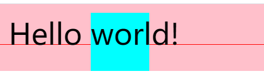
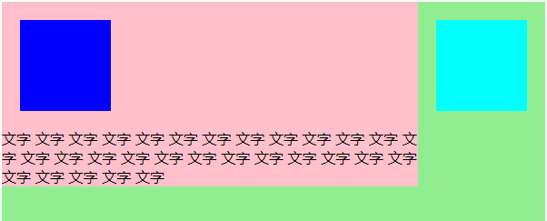

# WEEK08-总结 重学CSS 
## 选择器语法
* 简单选择器
    * \* 
    * div svg|a (namespace)
    * .cls
    * #id
    * \[attr=value\]
    * :hover
    * ::before
* 复合（compound）选择器
    * <简单选择器><简单选择器><简单选择器>
    * \*或者tagselector必须写在前边
* 复杂选择器
    * <复合选择器>\<sp\><复合选择器>
    * <复合选择器>">"<复合选择器> *无回溯实现*
    * <复合选择器>"~"<复合选择器> *无回溯实现*
    * <复合选择器>"+"<复合选择器> *无回溯实现*
    * <复合选择器>"||"<复合选择器>*（选中 table一列）*  

* 简单选择器计数  

    `#id div.a#id { }`  
    优先级为大小为 行内>id>class>tag，上边的可以归为 `[0,2,2,1]` 四元组，四元组成员依次为 行内、id、class、tag的数量，具体[week06](../week06/NOTE2.md#step-6-生成computed属性)里总结过。

    用四元组计算优先级公式：（N为一个足够大的数）  

    优先级举例：
    |选择器|优先级四元组|原因说明|
    |--|--|--|
    |`div#a.b .c[id=x]`|`[0,1,3,1]`|**属性选择器**的优先级**等同于**class|
    |`#a:not(#b)`|`[0,2,0,0]`|**not不参与**优先级运算|
    |`*.a`|`[0,0,1,0]`|**\*不参与**优先级运算|
    |`div.a`|`[0,0,1,1]`|Tag 1个 + class 1个|

* 伪类
    * 链接/行为
        * :any-link
        * :link *(没访问过的超链接)* :visited
        * :hover
        * :active
        * :focus
        * [:target](https://developer.mozilla.org/zh-CN/docs/Web/CSS/:target)
    * 树结构
        * :empty
        * :nth-child()
        * :nth-last-child()
        * :first-child :last-child :only-child  
          
        > 以上几个伪类在startTag的computeCss步骤时，不能实现的有nth-last-child、last-child、only-child，因为这三个要在标签结束后**再**往后检查一个token后需要**回溯**才能确定；nth-child和first-child都在startTag时已经知道是第几个child；empty比较特殊，虽然它在startTag时也不知道，但它只需要在startTag后只检查一个Token是不是endTag或自封闭标签，便可以确定。因此一般浏览器，都会选择实现empty、nth-child、first-child，其他几个不一定实现。

        **实践原则**：需要回溯的伪类不推荐用，因为即使浏览器实现了，代码也会很复杂，影响layout的次数。
    * 逻辑型
        * :not伪类 level3可以跟复合选择器 level4还可以选择器列表（不推荐）
        * :where :has
* 伪元素
    * ::before
    * ::after
    * ::first-line (与排版有关，与实际显示有关系，实在浏览器里显示的第一行)
    * ::first-letter
    

    **Q： 为什么`first-letter`可以设置`float`，`first-line`却不可以？**   
    A： first-line如果float就会脱离流，就不是第一行了，产生无限循环。  

    **Q： 那`first-line`为什么可以改字体？（改了字体也不是`firstline`了）**  
    A： 字是一个一个的渲染的，`first-line`并不是先算好那些文字在`first-line`里边，然后应用这些特性。而是在排版过程中，把`first-line`相关的属性直接加到文字上（如上图可见`first-line`的所有属性，除line-height外都是作用在文字上的，没有作用于盒的），直到这行满了，不是firstline了，就撤销掉这些属性。layout时操作computeCSS相关的动作。  

    `first-letter`是固定的**源码**里的第一个文字，而`first-line`是**排版**中的第一行，是两个不同层次的概念。

作业：
Toy-browser中的match详细实现：(可选not where has)
```javascript
function match(selector, element){
    return true;
}
match("div #id.class", document.getElementById("id"));
```

# 排版
## 盒（BOX）

|源代码|语义|表现|
|--|--|--|
|标签（Tag）|元素（Element）|盒（Box）|  
  
* HTML代码中可以书写开始**标签**，结束**标签**，和自封闭**标签**。  
* 一对起止**标签**，表示一个**元素**。  
* DOM树中存储的是**元素**和其他类型的节点（Node）。  
* CSS选择器选中的是**元素**，在排版时可能产生多个**盒**。  
* 排版和渲染的基本单位是**盒**。 

另外：  
* 元素是node的一种。
* 选不中元素外的任何节点，如注释节点doctype
* 排版产生多盒情况：  
    1. inline元素分行会产生多个盒 
    2. 有伪元素的情况
    3. first-letter

## 盒模型
TODO: getStyle改造为根据盒模型计算  
margin：排版中表示图片周围的留白  
padding：排版中的页边距，打印不能打印到纸边  

## 正常流排版
1. 收集盒进入行  
2. 计算盒在行中的排布  
3. 计算行的排布  

### 正常流的结构：
分为IFC和BFC。

* Inline Formating Context  

可以简单的理解为从左到右的就是IFC。  

一行的排布，大致从左到右排，可能遇到文字，还可能遇到有宽高inline-box，他们会有一个对齐关系。  

在更新的CSS标准中，display分成两部分，分别是带和不带inline的版本。如flex和inline-flex。 

放文字进入行，会产生行盒，行盒不对应任何元素，是一个虚拟元素，first-line就是应用了这个行盒，实际上就是第一个line-box。 

在一个行内元素里放很多inline文字，就会产生很多行的看不见的行盒。给这个行内元素设背景色看到的就是这些行盒内包含的inline盒。


* Block Formating Context  

可以简单的理解为从上到下的就是BFC。  
line-box可以和block-box一起从上到下排在纵轴。

  

记住下面这个表现原则：如果一个元素具有 BFC，内部子元素再怎么翻江倒海、翻云覆雨，都不会影响外部的元素。所以，BFC 元素是不可能发生 margin 重叠的，因为 margin 重叠是会影响外部的元素的；BFC 元素也可以用来清除浮动的影响，因为如果不清除，子元素浮动则父元素高度塌陷，必然会影响后面元素布局和定位，这显然有违 BFC 元素的子元素不会影响外部元素的设定。  

## 文字

### 文字混排关系

文字有本身占据的空间和对齐的关系，行内盒也跟文字有对其关系，还有行高的概念。

基线概念，中文无基线，红线是基线。  


看如下代码：
```html
<div class="container" style="font-size:50px; line-height:100px; background-color:pink;  ">
    <div class="refline" style="vertical-align:baseline; overflow:visible; display:inline-block; width:1px; height:1px;">
        <div style="width:1000px; height:1px; background:red;"></div>
    </div>
    Hello
    <div class="inline-block" style="line-height:100px; width:100px; height:100px; background-color:aqua; display:inline-block;">world!</div>
</div>
```
打开浏览器，效果如下：(.refline是基线参考线)  
  
`Hello`与`world`基线对齐，因为`.container`的行高与`.inline-block`的高度一致，所以蓝色的`.inline-block`与容器粉红色`.container`也是完全对齐的。  

现在把`.inline-block`的行高改为`70px`：
```html
...
<div class="inline-block" style="line-height:70px; width:100px; height:100px; background-color:aqua; display:inline-block;">world!</div>
...
```
效果如下：  
  

现在`.inline-block`的行高70px小于本身的高度100px，而对齐方式又是baseline，文字依旧会基线对齐，而这时`.inline-block`的位置就必须要向下移动才能保证本身的文字与`.container`的文字基线对齐，向下移动的同时，又撑开了父元素`.container`的高度。  

这时如果将`.inline-block`内部的文字清空，会发生什么呢？  
把文本`world!`删除：
```html
...
<div class="inline-block" style="line-height:100px; width:100px; height:100px; background-color:aqua; display:inline-block;"></div>
...
```
效果如下：  
  

这时，`.inline-block`的底部与`.container`的基线对齐了，说明**一个line-box内如果没有文字的话，那么这个line-box的基线就会在最底部**。
  
接下来，如果把`.inline-block`高度设置为大于容器行高的`150px`，同时`vertical-align`设置为`top`，则顶端对齐，且父元素内hello的行高会被撑高到`150px`。  

  
  
再将`vertical-align`设置为`bottom`，父元素内hello的行高也会被撑高到`150px`，但因为对齐方式是`bottom`（元素底部与整行底部对齐），所以必须得向上撑开了：  

  

这时的`top`其实也变成了撑高之后的top，如果再添加一个50px行高vertical-align为top的元素即可得到验证：
```html
<div style="font-size:50px; line-height:100px; background-color:pink;  ">
    <div class="refline" style="vertical-align:baseline; overflow:visible; display:inline-block; width:1px; height:1px;">
        <div style="width:1000px; height:1px; background:red;"></div>
    </div>
    Hello
    <div class="inline-block" style="vertical-align:bottom; line-height: 70px; width:100px; height:150px; background-color:aqua; display:inline-block;"></div>
    <div class="inline-block-2" style="vertical-align:top; line-height: 70px; width:100px; height:50px; background-color:aqua; display:inline-block;"></div>
</div>
```


如果这时再添加一个特别高的元素，将行高撑很大，则`.inline-block`与`inline-block-2`分别对齐撑高后的top和bottom。  
  

**结论1：行模型中，如果有元素超过行的高，就会把最高的元素作为行高并保证它的对齐。**  

**结论2：因此为了避免这种意料外的情况，应该尽量把内部inline-box的vertical-align设置为top、bottom、middle中的一种，高度一致的情况下，无论内部有没有文字都一直对齐，这样就会避免baseline出现的意料外情况。**

* 使用[dom.getClientRects()](https://developer.mozilla.org/zh-CN/docs/Web/API/Element/getClientRects)可以在一个行内元素里得到的行盒里面各inline的位置。

> **[align-vertical的值](https://developer.mozilla.org/zh-CN/docs/Web/CSS/vertical-align)：***（部分）*   
top：使**元素及其后代元素的顶部**与**整行**的顶部对齐。  
bottom：使**元素及其后代元素的底部**与**整行**的底部对齐。  
middle：使**元素的中部**与**父元素**的基线加上父元素x-height的一半对齐。  
text-top：使**元素的顶部**与**父元素的字体**顶部对齐。  
text-bottom：使**元素的底部**与**父元素的字体**底部对齐。  
> 
> top和bottom都是相对行的，而middle是相对父元素的。


## 浮动 float 与 clear
原理：先在原位渲染一个块级元素，然后脱离文档流顶到left或right。

## margin折叠
**边距折叠只会发生在BFC里**，且发生在交叉轴，inline-box、float里不存在边距折叠。  

CSS2.1文档中[BFC](https://www.w3.org/TR/2011/REC-CSS2-20110607/visuren.html#block-formatting)的概念：  
> Floats, absolutely positioned elements, block containers (such as inline-blocks, table-cells, and table-captions) that are not block boxes, and block boxes with 'overflow' other than 'visible' (except when that value has been propagated to the viewport) establish new block formatting contexts for their contents.

[Block-level elements and block boxes](https://www.w3.org/TR/2011/REC-CSS2-20110607/visuren.html#block-boxes)定义：  
> block containers 是里面可以容纳block的元素， block level box可以作为block放进正常流里的元素（如'block','list-item','table'），block boxs是里外都是block的元素。

也就是说，产生BFC的有以下几种：
1. 浮动元素，设置了float的元素，脱离了文档流
2. 绝对定位元素，position设置为absolute的元素，脱离了文档流
3. 不是block的块容器（例如inline-block，table-cell，table-caption）
4. overflow 不是 visible 的 block-box

如果在同一BFC中，会有同向边距折叠和异向边距折叠。在不同的BFC的边距不会发生边距折叠。其实能容纳正常流的都会产生BFC（overflow:visible除外）。

### flex能否产生BFC
Flex-container是block level box，不是block container，不能产生BFC。  
Flex-item是block container，里边产生BFC。
|block level box|inline版|是否为block container|
|--|--|--|
|flex|inline-flex||
|table|inline-talbe||
|grid|inline-grid||
|block|inline-block|是|

||
|--|
|inline|
|run-in|

## BFC与Float共同作用
```html
<div style="height:500px; background-color:lightgreen; overflow:hidden;">
    <div class="float-box" style="float:right; width:100px; height:100px; background-color: aqua; margin:20px"></div>
    <div class="BFC-test" style="background-color:pink; overflow:hidden;">
        <div style="width:100px; height:90px; background-color:blue; margin:20px;"></div>
        文字 文字 文字 文字 文字
        文字 文字 文字 文字 文字
        文字 文字 文字 文字 文字
        文字 文字 文字 文字 文字
        文字 文字 文字 文字 文字
        文字 文字 文字 文字 文字
    </div>
</div>
```
效果如下：  
  

`.BFC-test`的overflow为hidden，因此产生了一个BFC，该BFC虽然占据一行，但它的待遇是一个inline行盒待遇，所以会顶到float边上却并不会占据`.float-box`的位置。 
  
这时，再把`.BFC-test`的 overflow 改为 visible ，`.BFC-test`这一层的BFC就消失了，`.BFC-test`内部的元素跟`.float-box`成为同一个BFC内部的内容，`.BFC-test`的区域就会铺到整行，文字会被拆成多行单个的行盒，就有绕排`.float-box`的效果。  
效果如下：  


## Flex排版
1. 收集盒进入行  
2. 计算盒在主轴方向的排布  
3. 计算交叉轴方向的排布  

